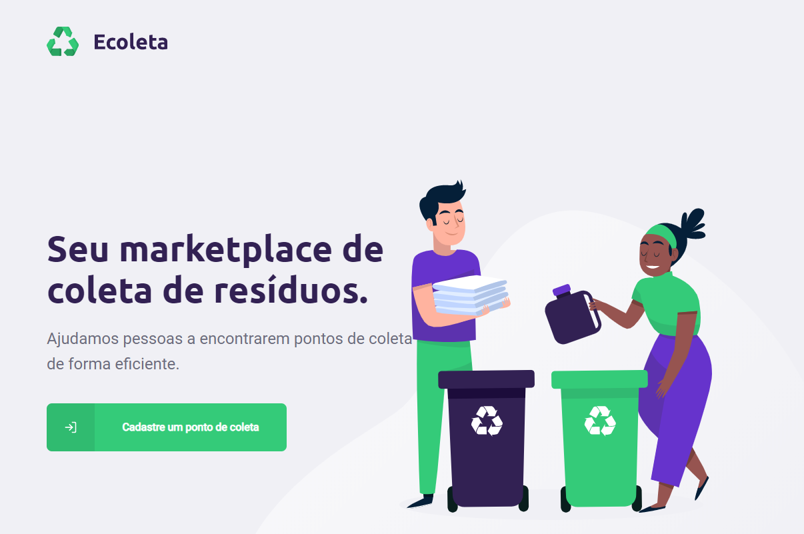

# Ecoleta-web
Waste collection project. Developed during the NLW (Next Level Week) offered by Rocketseat

## Technologies

- [ReactJs](https://pt-br.reactjs.org/)
- [Leaflet](https://leafletjs.com/)
- [axios](https://github.com/axios/axios)

##  Project

Ecoleta is a project to provide locations that perform waste collection

## How to Run

1. Install the dependencies with `npm i`.
2. Run your application with `npm start`.
